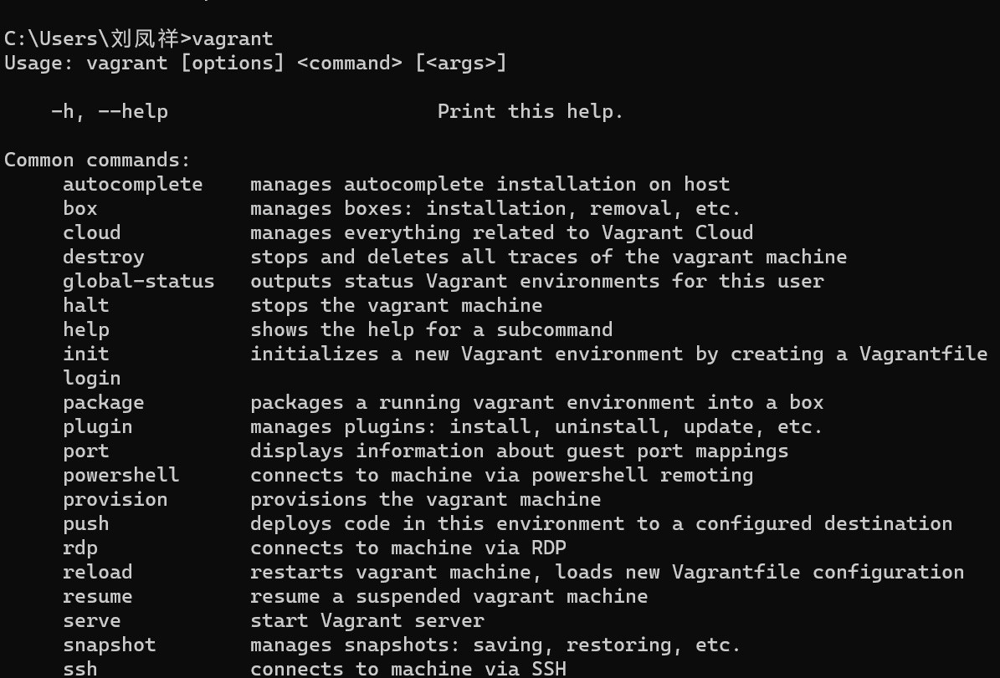
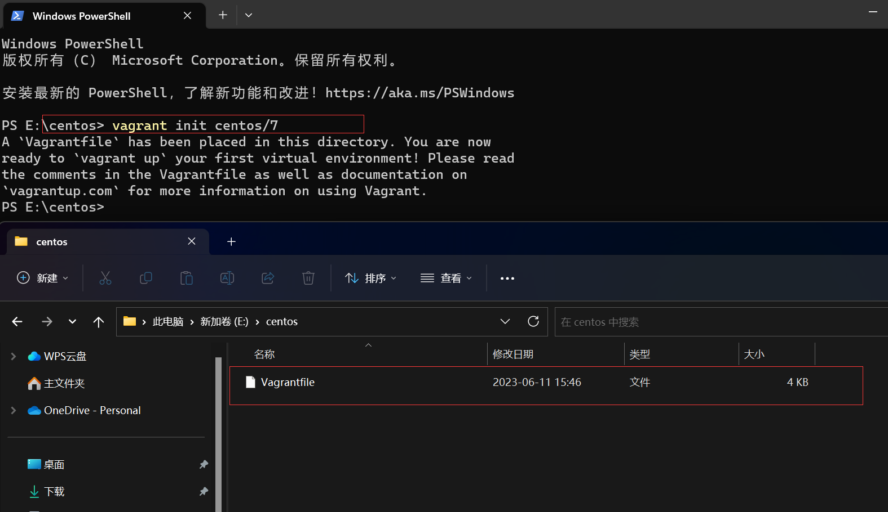
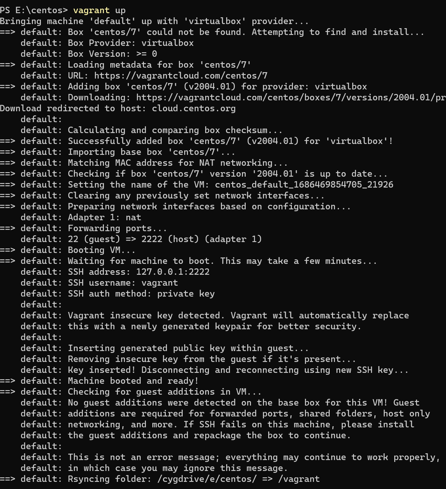
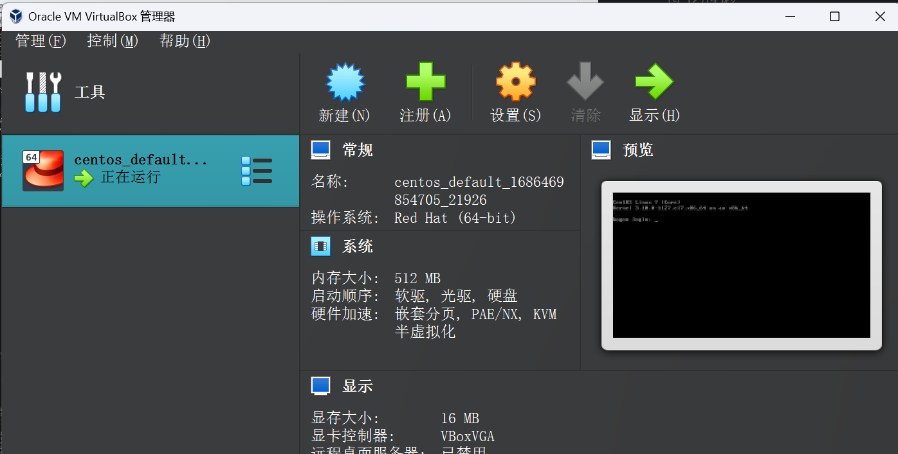
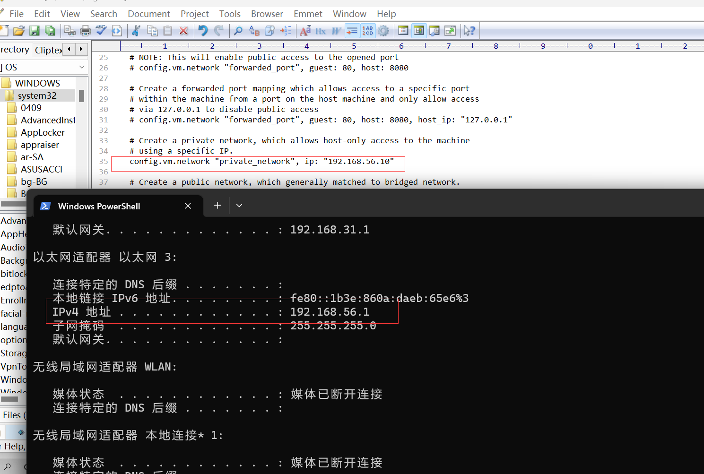
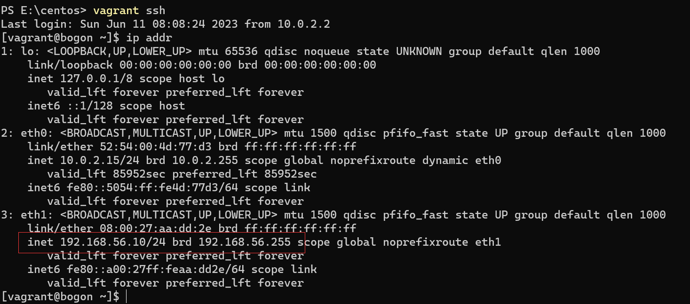
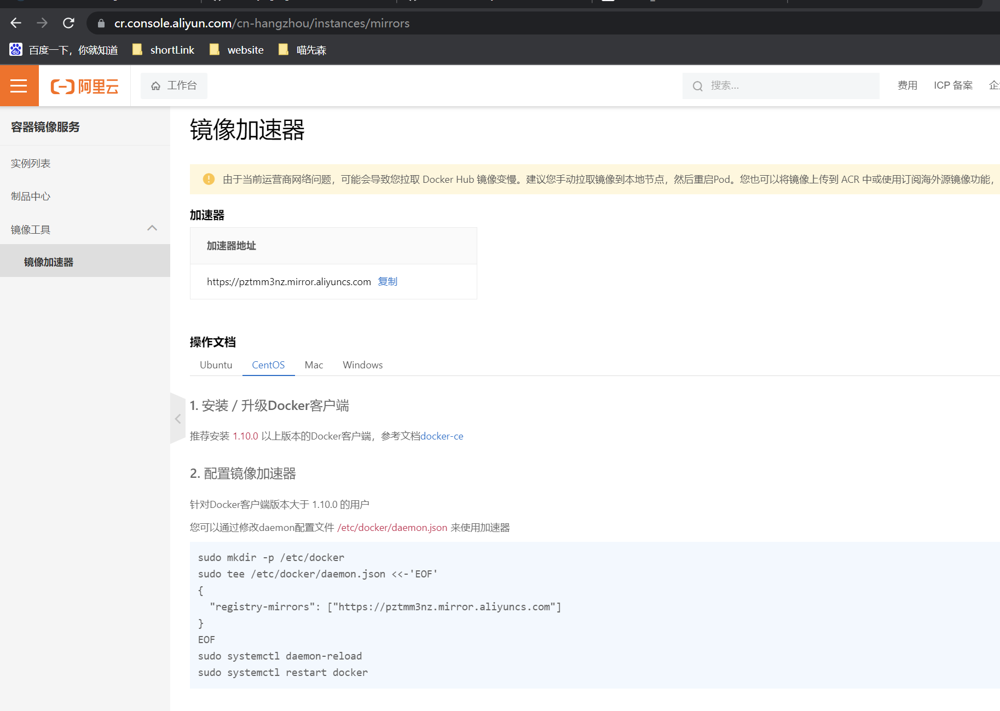

# 1.VirtualBox

[Website：>链接地址](https://www.virtualbox.org/wiki/Downloads)

# 2.Vagrant

[Website：>链接地址](https://www.vagrantup.com/)

[vagrant镜像仓库：>地址](https://app.vagrantup.com/boxes/search)

安装完成之后验证
`win +R`,`cmd`,`vagrant`会弹出如下：

表示安装成功。

# 3.通过vagrant安装虚拟机
+ 创建一个空的目录，cmd切换到该目录中，然后执行`vagrant init centos/7`会创建vagrantfile文件
+ 执行`vagrant up`第一次执行的时候会远程下相关的镜像文件，开启虚拟机。
+ 连接通过`vagrant ssh`连接
表示安装成功。

# 4.编辑vagrantfile文件
 解决网络地址转换-端口转发。
安装成功

# 5.docker
[安装文档](https://docs.docker.com/engine/install/centos/) | [镜像](https://hub-stage.docker.com/)
安装步骤:

`sudo -i`切换到root
+ 卸载原有的环境
> sudo yum remove docker \
                docker-client \
                docker-client-latest \
                docker-common \
                docker-latest \
                docker-latest-logrotate \
                docker-logrotate \
                docker-engine

安装对应的依赖环境和镜像地址
> sudo yum install -y yum-utils

> sudo yum-config-manager --add-repo https://download.docker.com/linux/centos/docker-ce.repo

安装过慢设置阿里云镜像
> sudo yum-config-manager --add-repo https://mirrors.aliyun.com/docker-ce/linux/centos/docker-ce.repo

查看版本
yum list docker-ce --showduplicates |sort -r

安装docker CE
> sudo yum install docker-ce docker-ce-cli containerd.io docker-buildx-plugin docker-compose-plugin

启动docker `sudo systemctl start docker`

查看docker版本 `docker -v` 或者 `cker version`

查看docker的启动状态 `systemctl status docker`

检查安装结果 `docker info`

查看docker镜像 `docker imnages` `docker ps`

设置docker开机自启动
> sudo systemctl enable docker

设置阿里云镜像加速器 [地址](https://cr.console.aliyun.com/cn-hangzhou/instances/mirrors)

> sudo mkdir -p /etc/docker

> sudo tee /etc/docker/daemon.json <<-'EOF'
{
"registry-mirrors": ["https://pztmm3nz.mirror.aliyuncs.com"]
}
EOF

> sudo systemctl daemon-reload

> sudo systemctl restart docker

# 6.mysql安装
安装MySQL8.0版本：`docker pull mysql:5.7`
> docker run \
    -p 3306:3306 \
    -e MYSQL_ROOT_PASSWORD=123456 \
    -v /home/data/mysql/log:/var/log/mysql \
    -v /home/data/mysql/data:/var/lib/mysql:rw \
    -v /home/data/mysql/conf:/etc/mysql \
    -v /home/data/mysql/mysql-files:/var/lib/mysql-files \
    -v /etc/localtime:/etc/localtime:ro \
    --name mysql \
    --restart=always \
    -d mysql:8.0

安装vim`yum -y install vim` 
安装rz`sudo yum -y install -y lrzsz`  
MySQL配置my.cnf
`touch my.cnf`
`vim`编辑添加如下内容
---
[client]
default-character-set=utf8

[mysql]
default-character-set=utf8

[mysqld]
init_connect="SET collation_connection = utf8_unicode_ci"
init_connect="SET NAMES utf8"
character-set-server=utf8
collation-server=utf8_unicode_ci
skip-character-set-client-handshake
skip-name-resolve
---

# 7.redis安装
> docker run -itd --name redis -p 6379:6379 \
   -v /home/data/redis/data:/data \
   -v /home/data/redis/conf/redis.conf:/etc/redis/redis.conf \
   -d redis:6.2.4 redis-server /etc/redis/redis.conf \
   --requirepass 123456

`redis.conf`文件路径:[官网](https://redis.io/docs/management/config/)

`docker ps`查看镜像，`docker exec -it ef51d17c795f redis-cli`进入容器内部。
使用redis客户端验证即可。
此处有个小坑，需要将redis.conf文件中的bind 127.0.0.1 注释掉，否则外部客户端连接不上redis
# 8.nacos安装
> 

